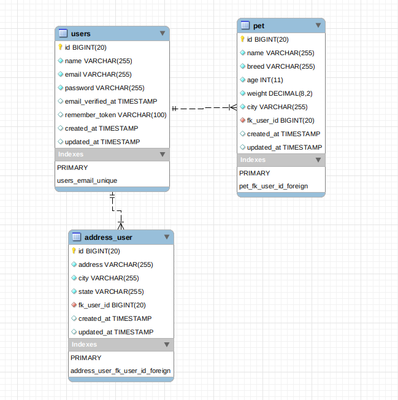

# How to run the project
 * Clone this repository 
 * Run ``` $ docker-compose up -d ```
 * Run ``` $ docker exec -it app composer install ```


# Creating Database User

* Run ``` $ docker exec -it db bash ```
* Run ``` $ mysql -u root -p123456 ```
* Run ``` $ show databases; ```
* Run ``` $ GRANT ALL ON laravel.* TO 'petfinder'@'%' IDENTIFIED BY '123456'; ```
* Run ``` $ FLUSH PRIVILEGES; ```
* Run ``` $ exit and exit container ```

* Run ``` docker exec -it app php artisan migrate ```

URL app: http://localhost/


Database Schema


